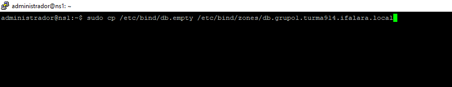

# DNS Master

* instalando o bind9
  * ``$ sudo apt-get install bind9 dnsutils bind9-doc``
  

 Figura 1: instalando o bind9 

 

* verificando o status do serviço
  * ``$ sudo systemctl status bind9``
  * caso não esteja ativo:
  * ``$ sudo systemctl enable bind9``
  

 Figura 2: verificando o status 

 

* acessar o diretório ``/etc/bind``
  * ``$ ls /etc/bind``
* criar o diretório ``/etc/bind/zones``
  * ``$ sudo mkdir /etc/bind/zones ``
  

 Figura 3: criar o diretório /etc/bind/zones 

 

* criar os arquivos db
  #### criando o arquivo de zona direta
  * ``$ sudo cp /etc/bind/db.empty /etc/bind/zones/db.grupo1.turma914.ifalara.local``
  
  

 Figura 4: criando o arquivo de zona direta 

 

  #### criando o arquivo de zona reversa	
  * ``$ sudo cp /etc/bind/db.127 /etc/bind/zones/db.10.9.14.rev``
  

 Figura 5: criando o arquivo de zona reversa 

 
  
* editando arquivos db 
   ``$ sudo nano db.labredes.ifalarapiraca.local ``
  

 Figura 6: editando arquivo db de zona direta 

 

   ``$ sudo nano db.10.9.14.rev``
   

 Figura 7: editando arquivo db de zona reversa 

 

* Adicionando as zonas 
  * ``$ cd /etc/bind/zones``
  * ``$ sudo nano /etc/bind/named.conf.local``
  

 Figura 8: Adicionando as zonas

 

* Verificando a sintaxe de configuração do BIND
  * ``$ sudo named-checkconf``
  

 Figura 9: Verificando a sintaxe de configuração do BIND 

 

* Verificando a sintaxe dos arquivos db
  * ``$ sudo named-checkzone grupo1.turma914.ifalara.local db.grupo1.turma914.ifalara.local``
  

 Figura 10: Verificando a sintaxe do arquivo de zona direta 

 

  * ``$ sudo named-checkzone 14.9.10.in-addr.arpa db.10.9.14.rev``
  

 Figura 11: Verificando a sintaxe do arquivo de zona reversa

 

* Configurando para somente resolver endereços IPv4
  * ``$ sudo nano /etc/default/named``
  * Adicionar linha ``OPTIONS="-4 -u bind"``
  

 Figura 12:  Configurando para somente resolver endereços IPv4 

 

* reiniciando o bind
  * ``$ sudo systemctl restart bind9``
  

 Figura 13: reiniciando o bind 

 

* adicionando os name servers

  * ``$ sudo nano /etc/netplan/00-installer-config.yaml``
  

 Figura 14: adicionando os name servers 

 

