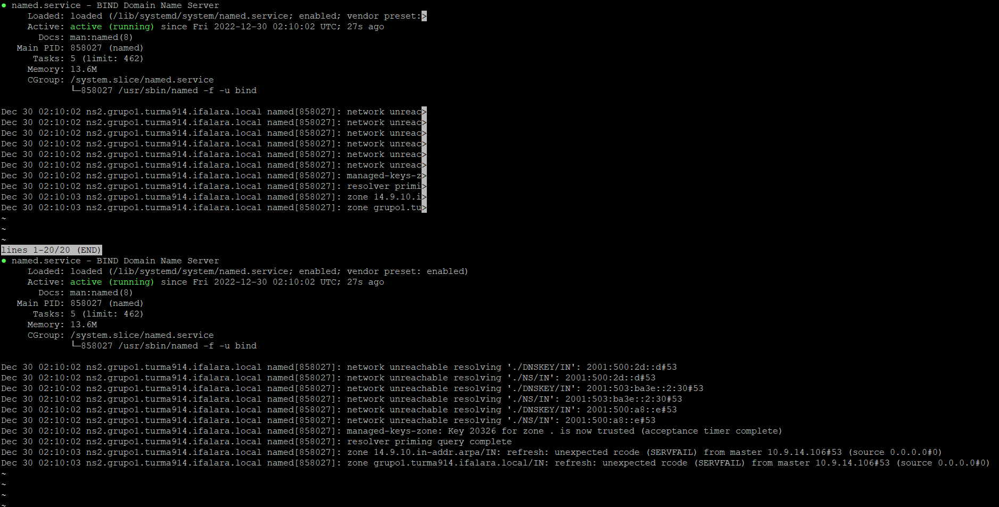

# DNS Slave
* Configurando a interface de rede com o netplan 
  * ``$ sudo nano /etc/netplan/00-installer-config.yaml`` 

 Figura 1: Configurando a interface de rede com o netplan 

 

* Instalando servidor DNS secundário (slave)
  * ``$ sudo apt-get install bind9 dnsutils bind9-doc -y``

 Figura 2: Instalando servidor DNS secundário (slave) 

 

* Verificando status do serviço
  * ``$ sudo systemctl status bind9``

 Figura 3: Verificando status do serviço 

 

* Configurando as zonas
  * Editando arquivo ``/etc/bind/named.conf.local``
  * ``$ sudo nano /etc/bind/named.conf.local``

 Figura 4: Editando arquivo /etc/bind/named.conf.local 

 

* Verificando status 

 Figura 5: Verificando o status 

 

* Fazendo os testes

 Figura 6: Fazendo os testes 

 

 Figura 7: Dig para ns2 

 

 Figura 8: Dig para www 

 

 Figura 9: Ping para www 

 

