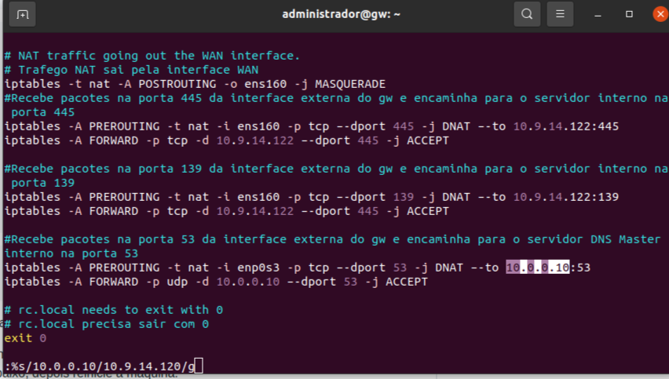

# Gateway

* Habilitando o firewall
     * ``sudo ufw enable``

 Figura 1: Habilitando o firewall 

 
     
* Habilitando o ssh
     * ``sudo ufw allow ssh``

 Figura 2: Habilitando o ssh 

 

* Configurando o arquivo ``/etc/ufw/sysctl.conf``
     * ``sudo nano  /etc/ufw/sysctl.conf``

 Figura 3: Configurando o arquivo /etc/ufw/sysctl.conf 

 

* Descomentando a linha ``net/ipv4/ip_forwarding=1``  para permitir o transporte de pacotes entre as interfaces WAN e LAN

 Figura 4: Descomentando a linha net/ipv4/ip_forwarding=1 

 

* Conferindo as interfaces de rede 
     * ``ifconfig -a``

 Figura 5: Conferindo as interfaces de rede 

 

* Configurando as interfaces de rede
     * ``ls -la /etc/netplan/`` para procurar o arquivo .yaml configurável

 Figura 6: Configurando as interfaces de rede 

 

* ``sudo nano /etc/netplan/00-installer-config.yaml``

 Figura 7: sudo nano /etc/netplan/00-installer-config.yaml 

 

 Figura 8:  arquivo sudo nano /etc/netplan/00-installer-config.yaml 

 

* ``sudo netplan apply`` para salvar as alterações

 Figura 9: sudo netplan apply

 

* Criando o arquivo ``/etc/rc.local`` 
     * ``sudo vi /etc/rc.local``

 Figura 10: Criando o arquivo /etc/rc.local

 

 Figura 11: Arquivo criado

 

* Adicionando script 

 Figura 12: Adicionando script

 

* Reiniciando 
     * ``sudo reboot``

 Figura 13: Reiniciando

 

* Permissão de execução do arquivo
     * ``sudo chmod 775 /etc/rc.local``

 Figura 14: Permissão de execução do arquivo

 

* Verificar status do firewall
     * ``sudo ufw status``

 Figura 15: Verificar status do firewall

 

* Corrigindo as informações do script 
#### Trocando a interface enp0s3 pela ens160

 Figura 16: Trocando a interface enp0s3 pela ens160

 

#### Trocando a interface enp0s8 pela ens192

 Figura 17: Trocando a interface enp0s8 pela ens192

 

#### Trocando o endereço IP para o IP do SAMBA

 Figura 18:Trocando o endereço IP para o IP do SAMBA

 

#### Trocando o endereço IP para o IP do nameserver1

 Figura 19: Trocando o endereço IP para o IP do nameserver1

 

