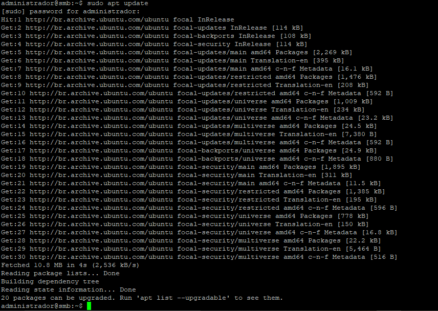
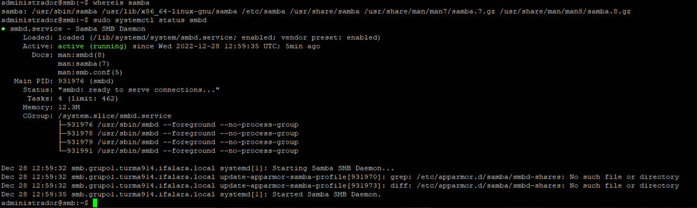
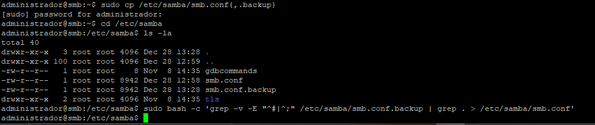
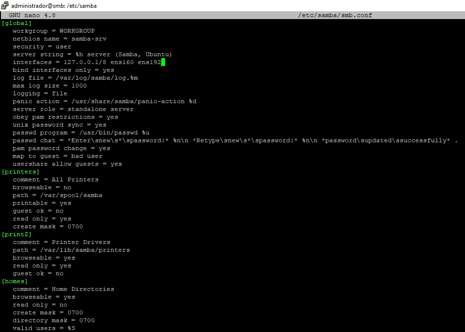

# Samba

* Entrando na VM

     * ``$ ssh administrador@10.9.14.122``

* Informações da VM

     * ``$ ifconfig -a``

<p><center> Figura 1: Informações da VM </center></p>
</br>

* Instalando o Samba na VM

     * ``$ sudo apt update``
<p><center> Figura 2: sudo apt update </center></p>
</br>


``$ sudo apt install samba``
     
<p><center> Figura 3: sudo apt install samba </center></p>
</br>

<p><center> Figura 4: sudo apt install samba </center></p>
</br>


* Verificando se o Samba foi instalado e se está rodando

     * ``$ whereis samba``

     * ``$ sudo systemctl status smbd``
     
<p><center> Figura 5: Verificando se o Samba foi instalado </center></p>
</br>

``$ netstat -an | grep LISTEN``
<p><center> Figura 6:netstat -an | grep LISTEN </center></p>
</br>


* Fazendo o backup do arquivo de configuração do samba e criando e alterando um arquivo novo somente com os comandos necessários.

     * ``$ sudo cp /etc/samba/smb.conf{,.backup}``

     * ``$ ls -la``

     * ``$ sudo bash -c 'grep -v -E "^#|^;" /etc/samba/smb.conf.backup | grep . > /etc/samba/smb.conf'``
     
<p><center> Figura 7: Fazendo o backup do arquivo de configuração do samba e criando e alterando um arquivo </center></p>
</br>

* Editando o arquivo de configuração /etc/samba/smb.conf e adicionando as interfaces da VM

     * ``$ sudo nano /etc/samba/smb.conf``
<p><center> Figura 8: Editando o arquivo de configuração /etc/samba/smb.conf  </center></p>
</br>


```
[global]
   workgroup = WORKGROUP
   netbios name = samba-srv
   security = user
   server string = %h server (Samba, Ubuntu)
   interfaces = 127.0.0.1/8 ens160 ens192
   bind interfaces only = yes
   log file = /var/log/samba/log.%m
   max log size = 1000
   logging = file
   panic action = /usr/share/samba/panic-action %d
   server role = standalone server
   obey pam restrictions = yes
   unix password sync = yes
   passwd program = /usr/bin/passwd %u
   passwd chat = *Enter\snew\s*\spassword:* %n\n *Retype\snew\s*\spassword:* %n\n *password\supdated\ssuccessfully* .
   pam password change = yes
   map to guest = bad user
   usershare allow guests = yes
[printers]
   comment = All Printers
   browseable = no
   path = /var/spool/samba
   printable = yes
   guest ok = no
   read only = yes
   create mask = 0700
[print$]
   comment = Printer Drivers
   
   path = /var/lib/samba/printers
   browseable = yes
   read only = yes
   guest ok = no
[homes]
   comment = Home Directories
   browseable = yes
   read only = no
   create mask = 0700
   directory mask = 0700
   valid users = %S
[public]
   comment = public anonymous access
   path = /samba/public
   browsable =yes
   create mask = 0660
   directory mask = 0771
   writable = yes
   guest ok = yes
   guest only = yes
   force user = nobody
   force create mode = 0777
   force directory mode = 0777
```

<p><center> Figura 9: Adicionando as interfaces da VM </center></p>
</br>

* Reiniciando o serviço smbd

     * ``$ sudo systemctl restart smbd``
<p><center> Figura 10: Reiniciando o serviço smbd </center></p>
</br>


* Conferindo se os IPs das interfaces da VM aparecem no serviço

     * ``$ netstat -an | grep LISTEN``

<p><center> Figura 11: netstat -an | grep LISTEN </center></p>
</br>


* Editando a pasta ``/samba/public`` para acesso a somente usuários do grupo sambashare

     * ``$ sudo nano /etc/samba/smb.conf``

```
[public]
   comment = public anonymous access
   path = /samba/public
   browsable =yes
   create mask = 0660
   directory mask = 0771
   writable = yes
   guest ok = no
   valid users = @sambashare
   #guest only = yes
   #force user = nobody
   #force create mode = 0777
   #force directory mode = 0777
```


<p><center> Figura 12: Editando a pasta /samba/public </center></p>
</br>


* Criando o usuário aluno 

     * ``$ sudo adduser aluno``
<p><center> Figura 13: Criando o usuário aluno </center></p>
</br>


* Alterando a senha do usuário aluno

     * ``$ sudo smbpasswd -a aluno``
<p><center> Figura 14: Alterando a senha do usuário aluno </center></p>
</br>


* Adicionando o usuário aluno ao grupo sambashare

     * ``$ sudo usermod -aG sambashare aluno``
<p><center> Figura 15: Adicionando o usuário aluno ao grupo sambashare </center></p>
</br>


* Criando diretório para o compartilhamento em rede

     * ``$ mkdir sambashare``

     * ``$ sudo mkdir -p /samba/public``

     * ``$ ls -la``

     * ``$ ls -la /``
     
<p><center> Figura 16: Criando diretório para o compartilhamento em rede </center></p>
</br>


* Alterando as permissões de grupo e de escrita

     * ``sudo chown -R nobody:nogroup /samba/public``
     * ``sudo chmod -R 0775 /samba/public``
     * ``sudo chgrp sambashare /samba/public``
<p><center> Figura 17: Alterando as permissões de grupo e de escrita </center></p>
</br>


* Cliente do compartilhamento

     * Tela do Windows Explorer com o acesso ao recurso compartilhado
     
<p><center> Figura 18: Tela do Windows Explorer com o acesso ao recurso compartilhado </center></p>
</br>
     
<p><center> Figura 19: Tela do Windows Explorer com o acesso ao recurso compartilhado </center></p>
</br>


